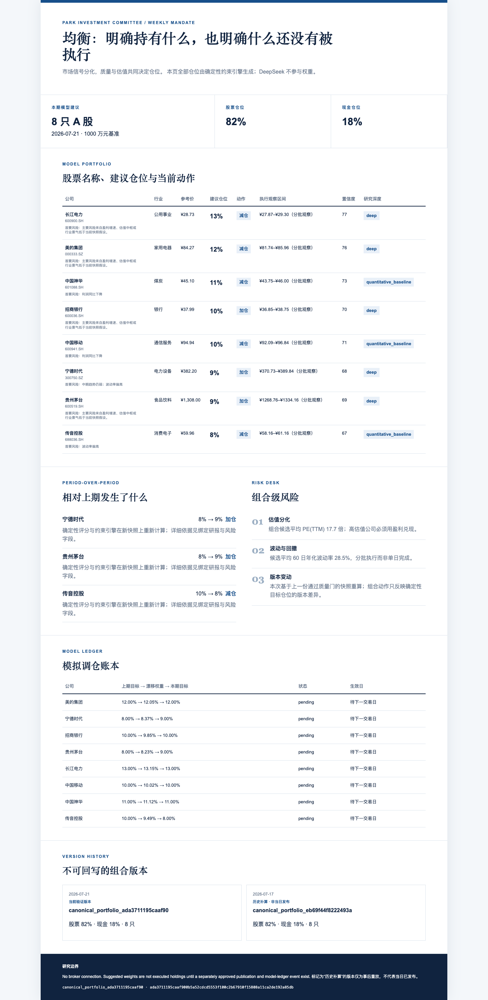
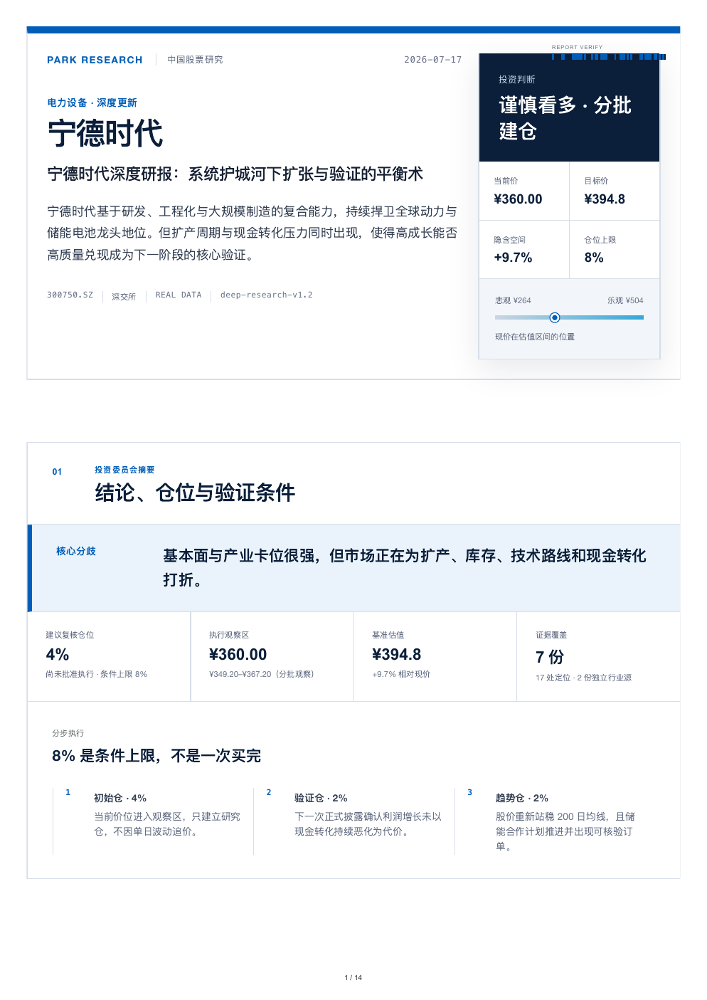
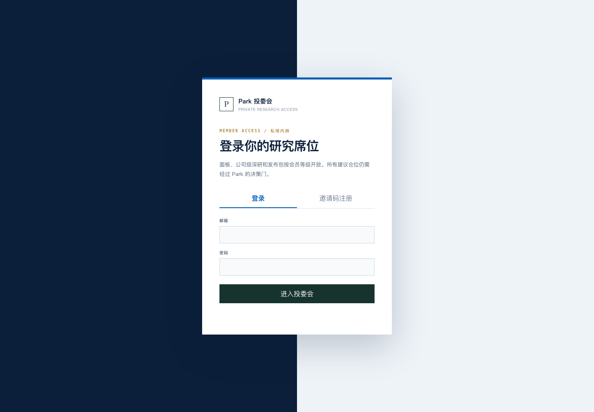
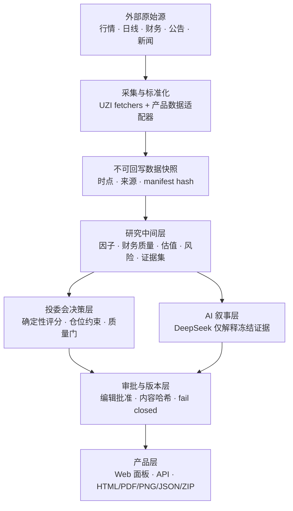

<div align="center">

# Park Equity Research

**面向长期资金的 A 股投委会与深度研报工作台**

[](#当前状态)
[](https://www.python.org/)
[](#验收)
[](#数据与证据边界)

输入经过验证的市场与公司证据，输出可审计的投委会结论、建议观察仓位和可发布的深度研报。

</div>

> 这是私有研究产品基线，不是券商交易系统。它不连接证券账户、不自动下单，也不把 AI 生成文字当成事实来源。

## 能力合同

| | 合同 |
|---|---|
| **输入** | 股票代码、行情/前复权日线/财务快照、公司级证据集、研究规则版本 |
| **输出** | 组合投委会面板、股票名称、建议观察仓位、核心理由、风险与证据；符合发布门时可生成 HTML / PDF / 长 PNG / JSON / ZIP |
| **成功条件** | 输入身份、时点、覆盖率、研究深度和审批哈希全部通过质量门 |
| **失败方式** | 数据不完整或过期时保留上一份合格快照；证据不足时不生成正式目标价/执行仓位；审批身份变化时拒绝发布 |

## 产品截图

| 投委会首页 | 公司深度研报 | 私域登录 |
|---|---|---|
|  |  |  |

## 当前状态

代码与历史验收已经覆盖一套本地私域内测闭环；Git 仓库只分发源码、测试和精选证据，不分发任何真实 runtime：

- 首批 8 只 A 股的同一时点组合面板：贵州茅台、招商银行、长江电力、美的集团、中国移动、宁德时代、中国神华、传音控股。
- 早期 legacy 私域验收 runtime 是宁德时代 1 只 `deep` + 7 只 baseline；当前 M5 组合证据已绑定 M4 的五行业 live proof，因此是 5 只 `deep` + 3 只 `quantitative_baseline`。数据库与正文批准仍不进入 Git。
- 研究数据保存为不可回写快照；刷新失败不会覆盖上一份通过质量门的数据。
- 规则引擎负责数字、分数和仓位约束；DeepSeek 只基于冻结证据撰写正文，并且必须经过独立编辑批准。
- `preview / member / paid / owner` 四级私域权限已经实现；本地开发默认关闭身份门。
- 可生成带身份哈希的独立 HTML、A4 PDF、长图、JSON、渲染回执和 ZIP 发布包。
- 五个跨行业 company adapter 与统一冻结证据生产线已经通过结构验收；另有五份基于同一 REAL snapshot、实际捕获文档和独立语义审批的 live proof。fixture 与 live 产物严格分开。
- 两个连续 REAL snapshot 已生成内容寻址的统一组合版本；当前直接展示 8 只股票、82% 股票仓位、18% 现金、本期动作、版本差异和独立模拟调仓账本。

尚未产品化的边界：

- 还没有公网生产部署、正式 PostgreSQL/Supabase、邮件找回、支付订阅或长期影子回测。
- 还没有全市场选股池；当前研究范围是固定的 8 股观察组合。
- 当前组合仍有中国移动、中国神华和传音控股 3 只只达到量化基线，不能把 8 股组合称作 8 份完整深研。
- 当前建议仓位是研究合同，不是交易指令，也不会自动执行。

## 架构



核心目录：

```text
equity-research/
├── product/                         # 当前投研产品：数据、研究、API、UI、发布与测试
│   ├── data_core/                   # canonical 数据合同、SQLite adapter 与 Postgres migration
│   ├── static/                      # 单页前端
│   ├── tests/                       # 产品契约与攻击测试
│   ├── automation/                  # 可选 LaunchAgent 模板
│   └── runtime/                     # 本地数据库/报告/日志；永不提交
├── skills/deep-analysis/            # 复用的 UZI 数据采集与分析能力
├── evidence/                        # 经过挑选的视觉与验收证据
├── docs/                            # 数据源、架构和设计记录
└── decision-log.md                  # 关键决策与 Gotchas
```

## 快速启动

要求：Python 3.10+。本地面板只需要产品依赖，不需要安装完整 UZI 数据栈。

```bash
git clone https://github.com/zinan92/equity-research.git
cd equity-research
python3 -m venv .venv
source .venv/bin/activate
python3 -m pip install -r product/requirements.txt
python3 product/server.py --host 127.0.0.1 --port 8877
```

浏览器打开 <http://127.0.0.1:8877>。首次启动会在被 Git 忽略的 `product/runtime/` 中建立本地演示数据库。

fresh clone 首次启动只恢复 `DEMO` 结构和 8 股演示首页；不会恢复历史 `verified / deep` 研报、DeepSeek 批准或发布包。要重新获得这些能力，必须先从真实数据源构建通过质量门的快照与证据集。

健康检查：

```bash
curl -fsS http://127.0.0.1:8877/api/health
```

不要在真实数据库上使用 `--reset-demo`；这个参数只用于重建演示数据库。

## 常用工作流

### 更新真实数据与研报

canonical 更新入口用独立交易日历选择最新已收盘交易日，把现有行情、日线和财务 collector 写入 M2 数据基座；只有 8/8 snapshot-bound `research-report-v1` 标准研报通过才切换 active：

```bash
python3 product/refresh_engine.py --canonical --timeout 12
python3 product/refresh_engine.py --canonical --status
python3 product/refresh_engine.py --canonical --dry-run
# 可选：只在 primary 失败后启用显式冻结 bundle fallback
python3 product/refresh_engine.py --canonical --fallback-bundle <bundle.json>
```

它具备显式 fallback 回执、跨进程锁与断点恢复；研究阶段在独立禁网子进程中只读 `SnapshotReader`。Web 的 `/api/reports/{ticker}` 优先读取并再次校验 canonical active，因此一次成功更新会直接进入产品研报页面。详细合同见 [research-refresh-v1](docs/architecture/research-refresh-v1.md)。

旧版组合刷新入口继续负责组合首页、报告归档与版本差异；canonical active 已负责标准研报读取：

```bash
python3 product/refresh_engine.py --timeout 12
```

刷新只在行情、日线和财务覆盖 8/8 时激活新快照；失败时继续展示上一份合格结果。

### 生成首批 8 股研究包

```bash
python3 product/batch_research.py --timeout 12
```

只从当前合格快照离线重放：

```bash
python3 product/batch_research.py --no-refresh
```

### 生成 DeepSeek 证据约束稿

前置条件是当前数据库已经有通过质量门的 `verified` 报告与冻结证据集；fresh-clone DEMO 直接运行会按设计拒绝。满足前置条件后，复制环境样例并把密钥文件放在仓库外：

```bash
cp .env.example .env
export DEEPSEEK_API_KEY_FILE=/absolute/path/outside/repository/deepseek-key
python3 product/deepseek_writer.py 300750.SZ
python3 product/deepseek_writer.py 300750.SZ --status
```

项目不会读取或提交任何固定的个人密钥路径。编辑确认正文与证据 manifest 后，必须带上两个实际哈希和 reviewer 才能批准；未经批准的稿件不会进入发布包：

```bash
python3 product/deepseek_writer.py 300750.SZ --approve --reviewer Park \
  --expected-narrative-hash <reviewed-narrative-hash> \
  --expected-evidence-manifest-hash <reviewed-evidence-manifest-hash>
```

跨公司生产线把 snapshot、冻结 evidence manifest、company adapter、模板、模型与 prompt 版本绑定成一个输入身份。五行业结构与格式验收可离线重跑：

```bash
python3 scripts/verify_cross_company_research.py
python3 -m unittest product.tests.test_cross_company_research_v1 -v
```

`evidence/m4-cross-company-research/` 根目录五套产物是 structure-only fixture；`live/` 中五套产物来自同一 REAL snapshot、实际捕获的公司/独立文档、DeepSeek 草稿、evidence-editor 修订与四轮独立语义审查。两类产物都遵循同一八模块合同。详见 [cross-company-research-v1](docs/architecture/cross-company-research-v1.md)。

### 生成发布包

发布导出是可选能力，需要 Node.js 18+、Playwright Chromium、Pillow 和 Poppler（`pdfinfo` / `pdftotext`）：

```bash
python3 -m pip install -r product/requirements.txt
cd product
npm ci
npx playwright install chromium
cd ..
python3 product/publication_pack.py 300750.SZ
```

只有 `verified / deep`、证据身份仍有效、DeepSeek 正文已独立批准且仓位复核完成的研报才能导出。

## 私域会员内测

本地默认不开身份门。准备给少数朋友使用时：

```bash
python3 product/member_admin.py create-owner --email <owner-email> --name Park
python3 product/member_admin.py create-invite --owner-email <owner-email> --tier paid --max-uses 1 --valid-days 7
PARK_AUTH_REQUIRED=1 PARK_COOKIE_SECURE=0 python3 product/server.py --host 127.0.0.1 --port 8877
```

上述命令只用于本机 HTTP 内测。公网必须由 HTTPS 反向代理承接，并改为 `PARK_COOKIE_SECURE=1`。密码、邀请码、session 和用户数据库都属于本地运行态，不进入 Git。

## API

主要只读接口：

| 接口 | 用途 |
|---|---|
| `GET /api/health` | 服务与数据身份健康状态 |
| `GET /api/dashboard` | 组合首页数据 |
| `GET /api/committee` | 投委会汇总 |
| `GET /api/stocks/{ticker}` | 股票详情 |
| `GET /api/reports/{ticker}` | 标准化研报 payload |
| `GET /api/research/evidence/{ticker}` | 冻结证据集 |
| `GET /api/report-versions/{ticker}` | 不可变研报版本 |
| `GET /api/publication-packs/latest` | 最新发布包回执 |

写接口（刷新、批准、发布、会员操作）在开启身份门后按 entitlement 拒绝越权请求。完整列表见 [product/README.md](product/README.md)。

`GET /api/reports/{ticker}` 的完整报告使用 [`research-report-v1`](docs/product/research-report-v1.md)：固定 8 个必需模块、固定顺序和明确的公司/市场/币种/会计准则语义。证据不足的适用章节保持可见并标为 `missing_evidence`；不适用项标为 `not_applicable`。未知或乱序模块拒绝渲染和导出。

## 数据与证据边界

- canonical 数据基座合同为 [data-foundation-v1](docs/architecture/data-foundation-v1.md)：source manifest → raw object → quality gate → immutable snapshot；PostgreSQL/Supabase migration 已定义，线上项目尚未部署。
- 数字事实来自数据库、确定性公式和带时点的外部来源，不由语言模型生成。
- 数据快照绑定原始响应哈希、特征版本、组合模型版本和 `known_at`；输入未变时可重放。
- 研究证据区分 fact / inference / risk，缺失的同行、历史分位或经营因果必须显示为 Missing evidence。
- AI 叙事绑定研究逻辑、prompt、证据 manifest 与模型；其中任何一项变化都会使旧稿失效。
- 批准绑定内容哈希。批准后内容变化会自动 invalidated，无法继续发布。

## 配置

所有密钥都必须通过环境变量或仓库外的权限受控文件提供。

| 变量 | 默认 | 作用 |
|---|---|---|
| `PARK_DASHBOARD_DB` | `product/runtime/investment_dashboard_v2.db` | 本地 SQLite 路径 |
| `PARK_AUTH_REQUIRED` | `0` | 是否开启身份门 |
| `PARK_COOKIE_SECURE` | `0` | HTTPS 环境使用安全 Cookie |
| `DEEPSEEK_API_KEY_FILE` | `~/.park-secrets/deepseek/api-key` | 仓库外 DeepSeek key 文件 |
| `DEEPSEEK_MODEL` | `deepseek-v4-pro` | 写作模型 |
| `NODE_BINARY` | PATH 中的 `node` | 发布渲染 Node.js 18+ |
| `PLAYWRIGHT_PATH` | `product/node_modules/playwright` / npm 解析 | Playwright 模块路径 |
| `CHROME_PATH` | Playwright 自带 Chromium | 可选的浏览器可执行文件 |
| `PDFINFO_BINARY` | PATH 中的 `pdfinfo` | PDF 页数与结构校验 |
| `PDFTOTEXT_BINARY` | PATH 中的 `pdftotext` | PDF 文字指纹校验 |

## 验收

数据基座的离线 ingestion、质量阻断、snapshot replay 和 export/import 恢复：

    python3 scripts/verify_data_foundation.py
    python3 -m unittest product.tests.test_data_foundation -v

自动更新状态机的两日增量、fallback、失败保留、断点恢复与 no-network replay：

    python3 scripts/verify_research_refresh.py
    python3 -m unittest product.tests.test_research_refresh_v1 -v

产品测试：

```bash
python3 -m unittest discover -s product/tests -q
```

fresh-clone 基线验收（会使用临时数据库与临时端口，不改真实运行态）：

```bash
python3 scripts/verify_baseline.py
```

秘密扫描：

```bash
gitleaks git --redact --no-banner
```

验收通过只证明 DEMO 本地基线可恢复、代码契约通过且未检测到已知密钥；它不证明 verified 深研运行态、实时外部数据源、生产部署或付费链已经就绪。

## 开发规则

- 一个 issue、一个 `codex/*` 分支、一个 PR；PR 必须写 What / Why / Validation 并关联 issue。
- 不提交 `product/runtime/`、`.env`、cookie、session、浏览器状态或本机缓存。
- 产品逻辑变化必须记录在 `decision-log.md`，并补充对应 Gotchas。
- 数据不足要 fail closed；不能用“看起来合理”的样例数据伪装成真实研究。
- PR 由 `park-ai-bot` 提交，等待 Park 评审；bot 不批准、不合并。

## For AI Agents

先阅读 [AGENTS.md](AGENTS.md) 和 [decision-log.md](decision-log.md)。当前产品入口是 `product/server.py`，不是根目录的 UZI `run.py`；后者属于可复用的分析 skill。涉及数据、研究、叙事、审批和发布时，保持以下边界：

1. 原始数据和证据先冻结，再进行研究计算。
2. 确定性结论与 AI 叙事分层保存。
3. 任何身份、时点、覆盖或批准不一致都必须拒绝发布。
4. 测试使用临时数据库；不得重置或读取用户真实 runtime。

## 来源与许可

仓库复用了 [wbh604/UZI-Skill](https://github.com/wbh604/UZI-Skill) 的数据采集与多维分析能力，并在 `product/` 中实现独立的投委会、证据、版本、会员和发布层。上游组件遵循其原始 MIT License；新增产品代码沿用仓库 [LICENSE](LICENSE)。
