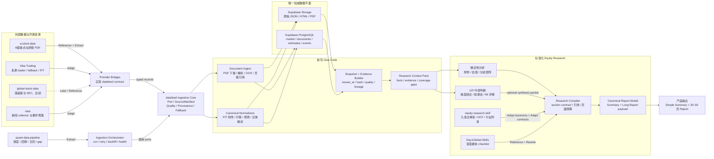

# 投研平台 Repo 拼装架构

状态：`Architecture defined / Implementation pending`
日期：2026-07-22
目标：最大化复用现有仓库，把新开发集中在数据契约、标准化、持久化和各模块之间的 glue code，而不是重建每个数据采集器和研究方法。

## 1. 复用等级

| 等级 | 含义 | 允许动作 |
|---|---|---|
| **Adopt** | 直接采用核心设计与大部分实现 | 保留接口和测试，只做包结构、配置及存储适配 |
| **Adapt** | 采用成熟模块，但改造成统一契约 | 保留业务逻辑，替换输入输出、错误处理、存储与 provenance |
| **Extract** | 只抽取少数经过验证的代码或机制 | 不引入整个仓库运行时或数据模型 |
| **Reference** | 作为来源目录、研究 checklist 或实现参考 | 在本项目重写，并补测试和缺失契约 |
| **Reject** | 不进入生产权威链 | 可留作只读参考，不成为依赖或 source of truth |

## 2. 总体架构

## 3. 每个 Repo 放在哪条 Branch

| Repo | 架构 Branch | 复用等级 | 具体采用 | 明确不采用 | 所需 Glue Code |
|---|---|---|---|---|---|
| `zinan92/datafeed` | **统一采集内核** | **Adopt primitives + Adapt runtime/storage** | 原样保留 `Port/Adapter`、registry、SourceManifest、raw response、quality、provenance、cache/fallback primitives 及相应测试模式；扩域和持久化按新契约改造 | 当前只覆盖 OHLCV 的薄模型；SQLite 作为生产 authority；按市场拆散的最终 schema | 把 `kline` 域抽成通用 `ingestion-core`；增加 document、fundamental、estimate、event record；增加 Supabase sink |
| `simonlin1212/a-stock-data` | **A 股 source adapters** | **Reference + Extract** | 腾讯、mootdx、东财、同花顺、Sina、巨潮等端点知识；东财个股/行业研报目录与 PDF 拼接逻辑 | 整份 `SKILL.md` 作为运行时；示例级限流、重试、本地 CSV 缓存；未经统一契约直接写正式表 | 把每个通过 pilot 的端点重写为 datafeed adapter；补 schema、timeout、rate limit、raw capture、fixture/live contract test |
| `HKUDS/Vibe-Trading` | **多源 fallback 与 PIT 工具箱** | **Adapt** | loader registry；A 股 fallback 顺序；TuShare fundamentals 的公告日/PIT 处理；local CSV/Parquet/DuckDB bridge；研报 metadata tool | 整个交易平台、agent swarm、策略运行时、会话 SQLite；只返回 metadata 而不保存 PDF 的研报链 | 将选中 loader 包装为 datafeed adapter；统一 symbol 和错误 envelope；把研报 metadata 接到 Document Ingest；校正统一 source priority |
| `simonlin1212/global-stock-data` | **全球股票扩展** | **Reference / Later** | SEC EDGAR、Yahoo、港美股行情、分析师预期和机构持仓端点 | 第一版 A 股主链；Yahoo 单源作为权威；现在就维护全球 schema 的全部边角 | 先预留 market/identifier 字段；MVP 不运行，全球版再实现 adapters 和 US/HK canonical mapping |
| `zinan92/quant-data-pipeline` | **数据运维与回填** | **Extract** | scheduler、backfill、gap detection、trade calendar、symbol/board metadata 更新思路和经过验证的算法 | 旧 SQLite schema、`sqlite.insert` 依赖、模拟交易/用户/决策表、与 datafeed 并行的 provider registry | 将调度任务改为调用 datafeed ports；运行状态写统一 `ingestion_runs/quality_results`；迁移日历和 gap 算法的专项测试 |
| `zinan92/intel` | **补充情报支线** | **Adapt** | SourceRegistry、Collector interface、collector run、RSS/Google News/Yahoo/website monitor、去重、48h event topology | 当前 SQLite authority；AI/crypto 为主的默认源；现有 ticker alias、权重、LLM 数字、旧凭据/发送脚本 | A 股实体解析；财经源白名单；Evidence/Inference 分离；输出 SourceManifest；事件必须指回原文 evidence；独立 intelligence snapshot |
| `rollingSirius/equity-research-skill` | **研报主框架** | **Adopt content taxonomy + Adapt scripts/contracts** | 直接采用九章 taxonomy、来源层级和行业附录；改造 DCF/Reverse DCF/EPV 与检查脚本以消费 typed Context Pack | 假设 agent 自己上网找资料；只检查关键词的浅层 citation gate；笼统“分析师观点” | 将每章改为 typed section contract；绑定 snapshot/evidence IDs；新增卖方研报逐篇矩阵、页级引用、篇幅预算、coverage gate |
| `star23/Day1Global-Skills` | **深度分析模块库** | **Reference + Rewrite** | 收入质量、利润率、现金流、指引、竞争、KPI、治理、会计质量、variant view、行动触发与反偏见模块 | 不存在的 reference 文件；美股科技专属假设；概率数字伪精确；直接作为完整报告模板 | 在本项目重写缺失 references；把模块变成行业可选 section；为每项定义输入字段、最低证据和缺失处理 |
| 当前 `zinan92/equity-research` / UZI | **研究编译与产品输出** | **Keep + Refactor consumer** | 现有 evidence gate、snapshot identity、报告渲染、投委会中层判断、Summary/HTML/PDF/长图输出 | UZI fetcher 聚合结果作为权威 evidence；报告运行时临时刷新事实；66 评委代替基础研究 | 改为只消费 versioned Research Context Pack；把确定性事实、模型推断和编辑结论分层；补 30–50 页标准模板 |

### 3.1 数据域唯一归属

“Primary”表示首个要接入、优先形成 canonical record 的 repo 资产，不等于该外部 provider 永久拥有 truth。权威性最终由 source policy、原始证据和 snapshot gate 决定。

| 数据域 | Primary repo 资产 | Fallback / 补充资产 | 复用方式 | 尚缺 Glue / 新 adapter |
|---|---|---|---|---|
| 证券主数据与名称历史 | Vibe 的 TuShare/多源 loader | quant 的 symbol metadata；a-stock 的东财/腾讯 basic | Adapt + Extract | `security-master` normalizer、名称/上市状态 PIT、统一 identifier |
| 交易日历 | quant 的 `calendar_updater` / trade calendar | Vibe 的 TuShare/AKShare loader | Extract | 交易所校验、缺口检测、known_at 与 calendar version |
| 日线行情与估值快照 | datafeed 现有 A-share port/provider contract | Vibe fallback；a-stock 的腾讯/mootdx/东财端点 | Adopt primitives + Adapt/Extract providers | 复权、停牌/涨跌停状态、provider conflict policy、Supabase sink |
| 财务报表与财务指标 PIT | Vibe 的 TuShare fundamentals PIT 处理 | a-stock 的 Sina/同花顺/CNINFO 结构化线索 | Adapt + Reference | 公告日/修订版 normalizer、原始财报 page evidence、口径映射 |
| 公司行动与复权因子 | **无 repo 完整覆盖** | Vibe/TuShare 与 a-stock/东财的局部能力 | Reference only | 新建 corporate-actions adapter；交易所/公司公告交叉核验；factor versioning |
| 公告、年报、季报原文 | a-stock 的 CNINFO/交易所端点知识 | Intel website monitor 只负责发现 | Reference + Extract / Adapt discovery | 官方 document adapter、PDF/HTML raw capture、OCR、页级索引、角色校验 |
| 卖方研报 PDF | a-stock 的东财研报目录 + PDF 逻辑 | Vibe 的 `research_reports_tool` metadata | Extract + Adapt | PDF ingest、SHA 去重、页级解析、broker/analyst entity、许可/可用状态 |
| 券商预测与一致预期 | Vibe 的东财 metadata + 同花顺 EPS | a-stock 的东财预测字段和 THS 端点 | Adapt + Extract | estimate schema、预测年度标准化、revision/dispersion snapshot |
| 新闻与事件 | Intel collectors + event topology | Vibe/a-stock 的财经新闻入口 | Adapt / Reference | A 股实体解析、canonical URL、语义去重、Evidence/Inference 分离 |
| 行业与板块归属 | quant 的 board/industry mapping | Vibe/a-stock 行业与 peers 数据 | Extract + Adapt | 行业分类版本、membership PIT、跨 provider taxonomy mapping |

这张表同时暴露一个真实空白：**公司行动/复权因子目前没有任何候选 repo 可以完整承担，必须新写官方来源 adapter。** 其余域优先复用已有模块。

### 3.2 组件追踪锁

采用的上游资产必须落入 `docs/architecture/repo-components.lock.yaml`，至少记录：

- repo URL、审计 commit SHA、license；
- 采用等级和具体文件/函数；
- 本地 wrapper/target module；
- contract tests；
- 上游更新策略和最后审计日期。

它不是依赖管理器，而是回答“我们到底复制/改造了什么、基于哪个版本、升级时该重验哪些契约”。

## 4. 真正需要新写的 Glue Code

这部分才是我们的核心工作；目标不是重写上游功能，而是让不同仓库可以安全组合。

### 4.1 `ingestion-core`

- 从 `datafeed` 抽象出通用 `SourceAdapter[T]`、`SourceManifest`、`FetchResult[T]`。
- 统一 ticker、时间、币种、单位、频率、公告日与 `known_at`。
- adapter 只能写 raw landing zone，不能绕过 normalizer 直接写 canonical 表。

### 4.2 `provider-bridges`

- `a-stock-data` endpoints → A 股 adapter。
- Vibe loaders → fallback adapter。
- Intel collectors → intelligence adapter。
- 每个 bridge 只负责协议转换、raw capture 和 provider-specific parsing，不决定投资结论。

### 4.3 `document-ingest`

- 研报/公告目录同步、PDF 下载、SHA256 去重、对象存储。
- 文本提取、OCR fallback、页码保留、表格/图片定位。
- 生成 `document → page → chunk → extracted_fact` 链路，任何引用可回到原 PDF 页。

### 4.4 `canonical-normalizers`

- 财务数据按报告期、公告日、修订版本做 point-in-time 化。
- 研报预测按券商、分析师、预测年份和发布日期标准化。
- 行情、复权、公司行动、证券状态分表；不把 provider schema 当 canonical schema。
- Intel 的 evidence、LLM inference 和 recommendation 严格分字段。

### 4.5 `snapshot-builder`

- 从 canonical 表和 raw hashes 冻结不可变 dataset snapshot。
- 输出机器可读 completeness、freshness、conflict 和 source coverage。
- 产出 versioned Research Context Pack；确定性分析、UZI synthesis 和 Research Compiler 都消费同一份 Pack。
- 研究生成器只接收 Context Pack / snapshot ID，生成过程中禁止直接调用外部 provider。

### 4.6 `research-compiler`

- 以 `equity-research-skill` 为主章节契约。
- 以 Day1Global 模块作为可选深挖 checklist。
- 将多份卖方研报生成观点矩阵、预测分歧、共识变化和反方证据。
- 确定性分析与可选 UZI synthesis 都先消费完整 Context Pack，再作为 typed inputs 交给 Compiler。
- Compiler 生成 canonical Report Model；UZI 不在 Compiler 之后运行，也不是报告发布的必经依赖。

## 5. 运行时边界

1. **只有 Supabase PostgreSQL + Storage 是 authority。** 所有 repo 自带 SQLite、CSV、Parquet 只能作为 cache、开发 fixture 或迁移输入。
2. **只有 datafeed contract 可以接入 canonical pipeline。** 外部 repo 不直接写 Supabase 正式表。
3. **研究只读 snapshot。** 生成 Summary 或长报告时不临时访问东财、TuShare、雪球或搜索引擎。
4. **Document 与 structured facts 并行保存。** 数字可以来自结构化表，但最终必须回到原始公告/研报和时点。
5. **UZI 66 评委属于 synthesis，不属于 evidence。** 它可以解释事实，不能创造事实。
6. **缺失显式降级。** 某个 provider 失败时显示 coverage gap；不得用另一个低权威源静默填满。

## 6. 实施切片

### Slice A：宁德时代数据闭环

User outcome：`300750.SZ` 可以形成一份冻结、可回放、含多份券商 PDF 页级引用的 Research Context Pack。

Success criteria：

- datafeed core 支持 market、fundamental、document、estimate、event 五类 record。
- 东财研报目录和 PDF adapter 进入 raw Storage；至少 50 份已验证 PDF 去重入库。
- 公司公告、财务、行情、研报预测和新闻事件进入统一 canonical identity。
- 任意结构化数字或卖方观点可追溯到 source、known_at、raw hash 和文档页。
- 相同 snapshot 在断网时可 deterministic replay。
- 任一 adapter 失败不会污染上一份通过质量门的 snapshot。

In scope：datafeed extension、a-stock/Vibe adapters、Supabase schema/storage、document pipeline、snapshot。
Out of scope：全球市场、自动交易、会员支付、全市场历史分钟线、前端重做。

### Slice B：三行业 Any-ticker 验证

用宁德时代、贵州茅台和一家银行验证同一 schema 与报告框架。行业专属字段以 optional module 处理，不复制三套 pipeline。

### Slice C：标准研报编译

把 rollingSirius 主骨架、Day1Global 模块和 UZI synthesis 接到同一个 Context Pack，稳定生成 Simple Summary 与 30–50 页报告。

## 7. 决策摘要

- 不是把 8 个仓库合并成 monorepo，也不是运行 8 个长期服务。
- 生产依赖的主体只有：扩展后的 `datafeed core`、新写的 canonical data/document/snapshot glue、现有产品端。
- 其他 repo 是可追踪的上游组件库：按 adapter、算法、checklist 或 framework 粒度吸收。
- 最大的新工作不是“抓数据”，而是统一 identity、PIT、provenance、storage、snapshot 和 research section contract。
