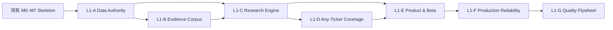

# A 股投研产品两层 Milestone Roadmap

状态：`Approved by Park / GitHub execution tree created / Implementation in progress`
日期：2026-07-22
GitHub：Milestones `L1-A`–`L1-G`；tracking issues `#65`–`#71`；Level 2 user stories `#28`–`#64`。
目标用户：Park、少数朋友与付费社群中，偏长期持仓、可投资资产 1000 万以上的 A 股投资者。
最终产品结果：用户输入任意受支持 A 股 ticker，先得到一页可行动 Summary，再得到一份结构一致、数据新鲜、引用可追溯的 30–50 页 Equity Research Report。

## 0. 当前起点

GitHub 已关闭 Gate 0 与 M1–M7：仓库恢复基线、标准研报合同、本地数据快照、自动刷新、跨公司报告、组合账本、私域会员与付费社群人工履约。这些成果证明产品 skeleton 与交付路径可以运行，但不代表以下能力已经完成：

- 全 A 股可持续数据 authority；
- 公告和几十份卖方研报组成的公司级 evidence corpus；
- 任意 ticker 的稳定 Summary + 30–50 页标准研报；
- Supabase 生产数据平面、RLS、备份、监控和可扩展部署；
- 长期研究质量与建议结果反馈闭环。

因此，后续 roadmap 不重做 M1–M7，而是把现有 skeleton 改造成真正的数据和研究产品。

## 1. 分层规则

- **Level 1 Milestone**：一个独立的大型用户价值结果。GitHub 中使用 `Milestone + Tracking Issue` 管理。
- **Level 2 Milestone**：可以独立验收的执行结果。每个 Level 2 建一张 Issue，并由一个 PR 或一条链式 PR 完成。
- **Level 3 Issue / To-do**：具体 adapter、schema、parser、UI surface、测试或迁移任务。只有在 Level 2 获批进入施工时创建。
- Level 2 Issue 必须包含：User outcome、3–7 项 Success Criteria、In scope、Out of scope、依赖、验证命令和验收证据。
- 当前文档定义前两层；Level 3 仍只在对应 Level 2 进入施工时即时创建。

## 2. Level 1 总览

| Level 1 | 大方向 | 用户最终获得什么 | Level 2 数量 | 进入条件 | 完成后解锁 |
|---|---|---|---:|---|---|
| **L1-A** | Canonical Data Authority | 一份可追溯、可回放、不会被外部接口临时故障污染的 A 股数据快照 | 5 | Repo 拼装架构获批 | Evidence Corpus、研究模型 |
| **L1-B** | Company Evidence Corpus | 公司公告、卖方研报、预测与新闻都成为可按页引用的证据 | 6 | A2 schema 与 A3 ingestion contract 稳定 | 真实深度研报 |
| **L1-C** | Standard Research Engine | 同一数据包稳定生成 Summary、行动建议和 30–50 页专业报告 | 6 | 章节合同可在 A1 后启动；真实验收需 CATL Evidence Pack | Any-ticker 产品 |
| **L1-D** | A-Share Any-Ticker Coverage | 不同公司、行业和覆盖深度都能给出诚实、稳定的结果 | 5 | C6 Report Model 稳定 | 面向用户开放 ticker 输入 |
| **L1-E** | Decision Product & Private Beta | 用户能搜索、阅读、比较、保存和反馈，不只是下载一份文件 | 5 | 至少三行业 truth set 通过 | 私域日常使用与付费验证 |
| **L1-F** | Production Reliability | 数据源故障、部署、权限、备份、成本和回滚可被运营 | 5 | A–E 核心路径明确 | 稳定付费社群运营 |
| **L1-G** | Research Quality Flywheel | 系统能验证过去判断、发现偏差并持续提高研究质量 | 5 | 有真实用户和历史版本 | 可积累的研究壁垒 |

总计：**7 个 Level 1、37 个 Level 2**。Level 3 不预设数量，只在对应 Level 2 获批后按独立验收结果即时创建，避免为了命中数字而过度拆票。

## 3. 依赖与并行关系



- A 与 B 的部分 adapter 工作可以并行，但 B 的正式 evidence set 必须读取 A 的 identity、storage 和 snapshot contract。
- C 的章节合同和 deterministic models 可提前设计；真实验收必须等待 CATL Evidence Pack。
- E 的阅读体验可基于固定 fixture 提前开发；ticker 正式开放必须等待 D。
- F 的安全、观测、备份和性能 controls 从 A 开始跟随各 L2 建设；`L1-F` 作为正式生产 Gate 在 E 之后汇总验收，不能脱离 B/E 独立宣告完成。
- G 只有产生真实历史版本和用户反馈后才有意义，不提前制造“智能优化”假象。

---

# Level 1 Milestones

## L1-A · Canonical Data Authority

**User outcome**：任何正式研究都读取同一份可追溯、point-in-time、可重放的 A 股数据快照，外部接口失败不会让用户看到半成品或静默变更的事实。

**Success Criteria**：

1. Supabase PostgreSQL + Storage 成为唯一生产 authority。
2. market、fundamental、document、estimate、event 五类 record 共用 datafeed contract。
3. 所有 accepted record 有 source、known_at、raw hash、provider/schema version 和 quality status。
4. 财务、证券状态、行业、公司行动和复权具备 point-in-time 版本。
5. snapshot 可在断网状态 deterministic replay。
6. provider 故障只产生 failed ingestion run，不替换上一份有效 snapshot。

**In scope**：datafeed primitives、Supabase、provider bridges、normalizers、orchestrator、snapshot。
**Out of scope**：分钟级高频行情、自动交易、全球股票、用户 UI 重做。

| L2 | Milestone | User outcome | Success Criteria | In scope | Out of scope | Depends on |
|---|---|---|---|---|---|---|
| **A1** | Canonical Data Contract v1 | 开发者可以依据一份可执行契约实现、验证和拒绝不合规 adapter | ① 五类 record schema 版本化；② SourceManifest/accepted/rejected 状态固定；③ schema/ADR 可由 contract tests 强制；④ adapter 不可绕过 provenance；⑤ 现有 ownership matrix/components lock 作为 entry evidence 通过一致性复核 | record types、SourceManifest、ADR、contract enforcement | 重做 ownership/component audit、写具体 adapters、建数据库 | 已批准架构与现有 component lock |
| **A2** | Supabase Canonical Schema & Raw Storage | 数据和原始证据有唯一、可备份的位置 | ① market/research/control schema 可迁移；② raw JSON/HTML/PDF 有确定 storage path；③ RLS/service role 边界定义；④ migration 可在空库重放 | DDL、migration、storage layout、dev seed | Auth UI、完整 production deployment | A1 |
| **A3** | Generalized datafeed Ingestion Core | 新数据源可以通过同一 Port/Adapter 接入 | ① datafeed 从 OHLCV 扩展五类 record；② raw capture/quality/fallback 共用 primitives；③ adapter contract tests 可复用；④ SQLite 只作 local cache | ingestion-core、Supabase sink、fixtures | 具体 provider 全覆盖 | A1, A2 |
| **A4** | A-Share Market, Identity & PIT Fundamentals | CATL 的行情、证券主数据和财务事实可以按当时已知版本查询 | ① security master/aliases 正确；② 日线、估值、交易日历双源校验；③ 财务按公告日和修订版保存；④ 公司行动/复权官方 adapter 可用；⑤ source conflict 留痕 | a-stock/Vibe adapters、quant calendar、PIT normalizers | 全市场批量、研报 PDF | A3 |
| **A5** | Orchestration, Quality & Immutable Snapshot | 一次刷新可以完整成功、失败隔离并生成可回放快照 | ① scheduler/backfill/gap detection 可运行；② ingestion run/quality result 完整；③ snapshot manifest 绑定 raw hashes；④ 并发刷新有锁和幂等；⑤ failure injection 保留上个有效版本 | quant patterns、orchestrator、snapshot builder、replay | 用户通知、研究写作 | A2–A4 |

## L1-B · Company Evidence Corpus

**User outcome**：用户看到的公司事实、卖方观点和预测都可以回到原始公告或 PDF 的具体页面，而不是模型记忆或搜索摘要。

**Success Criteria**：

1. 公司公告、年报和季报原文不可变保存。
2. 宁德时代至少 50 份有效卖方研报 PDF 去重入库。
3. PDF 文本、表格和页码可搜索并可回链原文。
4. 券商预测和一致预期可以按发布日期重放。
5. 新闻/事件与事实证据、LLM inference 严格分离。
6. evidence set 有 freshness、coverage、conflict 和 quality gate。

**In scope**：official documents、sell-side reports、estimates、document intelligence、Intel 情报支线。
**Out of scope**：自动购买付费报告、社交舆情决定仓位、全球研究库。

| L2 | Milestone | User outcome | Success Criteria | In scope | Out of scope | Depends on |
|---|---|---|---|---|---|---|
| **B1** | Official Filing & Announcement Ingest | 公司原始披露可以被稳定获取和引用 | ① 巨潮/交易所 adapter 可增量同步；② raw bytes/hash/MIME/HTTP metadata 完整；③ 年报/季报/重大公告分类正确；④ 官方角色校验阻止聚合器冒充 primary | CNINFO/Exchange adapters、document metadata | 卖方研报、OCR 深解析 | A2, A3 |
| **B2** | Sell-Side Report Catalog & PDF Archive | 用户可以看到研究结论来自哪些券商和哪些报告 | ① 东财目录增量同步；② PDF 下载/重试/限流可控；③ SHA/canonical URL 去重；④ broker/analyst/date/rating/pages 可查询；⑤ 缺 PDF 与 metadata-only 明确区分 | a-stock PDF logic、Vibe metadata、Storage | 观点综合、全文 OCR | A2, A3 |
| **B3** | Page-Level Document Intelligence | 每个进入正式报告的引用都能跳回正确 PDF 页面 | ① native text 与 OCR fallback；② chunk 与 source page 绑定；③ parser version 可重跑；④ corpus/parser 默认抽检页码映射准确率 ≥95%；⑤ 扫描页 OCR 可检索文本覆盖率默认 ≥90%；⑥ 进入 Report Model 的 citation 必须 100% 通过 document ID/page/raw hash 校验，否则对应 citation 与 claim 阻断发布；⑦ 表格定位错误必须显式标记而非静默抽取 | PDF parser、OCR、page/chunk schema、publication citation gate | 自动生成结论 | B1, B2 |
| **B4** | Broker Estimates & Consensus History | 用户能看到一致预期、分歧和修订方向 | ① EPS/revenue/profit/target 字段按预测年度标准化；② estimate 绑定 broker/report/date；③ consensus snapshot 可重放；④ 异常预测不静默进入均值 | 东财/同花顺 estimates、revision model | 自研盈利预测 | B2, A4 |
| **B5** | A-Share News & Event Intelligence | 重要事件被及时发现，但不会污染正式事实 | ① Intel collectors 输出 SourceManifest；② A 股 entity resolution 可测；③ 同事件跨源去重；④ inference 标记模型/prompt/version；⑤ source 失败显示 coverage gap | RSS/Google News/Yahoo/official monitor、event topology | 社交情绪自动交易、Reddit/HN 默认入包 | A3, A4 |
| **B6** | Evidence Set, Conflict & Coverage Gate | 报告只使用完整度和时点通过的数据 | ① evidence set 不可变；② primary/independent/lead 角色机器校验；③ freshness/known_at/conflict gate 可复算；④ rejected evidence 不进入 Context Pack；⑤ coverage report 明确缺什么 | evidence builder、quality policies、receipts | 报告写作和 UI | B1–B5, A5 |

## L1-C · Standard Research Engine

**User outcome**：同一个 Research Context Pack 可以稳定产出相同结构、相同口径的一页 Summary 和 30–50 页专业研报；换 ticker 不换方法。

**Success Criteria**：

1. 报告章节、输入字段、最低证据和缺失状态全部版本化。
2. 财务、估值和卖方分歧由确定性组件计算，可复算。
3. rollingSirius 主骨架与 Day1 模块被转成 typed contracts，不依赖缺失文件。
4. 确定性的 Decision & Position Policy 负责产生买/持/减、目标价和建议仓位；UZI 仅为可选解释输入。
5. Summary、HTML、PDF、长图读取同一个 Canonical Report Model。
6. 数字、结论和引用通过自动 gate 与编辑复核。

**In scope**：research contracts、models、sell-side synthesis、industry modules、compiler、report model。
**Out of scope**：全球公司统一模板、聊天式投顾、自动发布交易指令。

| L2 | Milestone | User outcome | Success Criteria | In scope | Out of scope | Depends on |
|---|---|---|---|---|---|---|
| **C1** | Research Section Contract v2 | 所有公司使用同一报告骨架和完成标准 | ① 15–18 个 section 有 typed schema；② 每节定义 required/optional inputs；③ full/partial/missing 语义固定；④ section/profile/version hash 进入 identity；⑤ B6 Evidence Gate 在真实数据验收时必须满足，但不阻塞合同设计 | rolling taxonomy、Day1 modules、page budget | 具体公司正文与真实 evidence 验收 | A1、已批准 Repo 架构 |
| **C2** | Deterministic Financial & Valuation Engine | 用户能复算关键财务趋势、情景和估值 | ① 历史财务桥接平衡；② Bull/Base/Bear 假设可审计；③ DCF/reverse DCF/comps/历史区间一致；④ 单位/币种/股本异常被拦截；⑤ sensitivity tables 稳定 | rolling scripts、current deterministic models | LLM 写数字、交易执行 | A4, C1 |
| **C3** | Sell-Side Viewpoint Matrix | 用户能看出机构共识、分歧和变化，而不是“综合认为” | ① 逐报告观点/预测/评级绑定 evidence；② consensus 与 outlier 分开；③ revision timeline 可见；④ bull/bear 证据均保留；⑤ 摘要不得超过原文证据强度 | report extraction、estimate matrix、contradictions | 自动判断券商正确性 | B2–B4, C1 |
| **C4** | Industry Profiles & Optional Modules | 不同行业有不同 KPI，但报告主结构不分叉 | ① 电池/消费/银行 industry profile 可用；② 每个 profile 提供候选 fixtures 和预期字段；③ 行业字段缺失不污染通用章节；④ 模块选择由 profile 决定；⑤ golden truth set 的独立审计留给 D2 | rolling industry appendices、Day1 optional modules、candidate fixtures | truth set 签字、全行业一次性覆盖 | C1, C2, B6 |
| **C5** | Decision, Target Price & Position Policy | Summary 中的买/持/减、目标价和建议仓位由可审计政策产生 | ① action 由估值区间、质量、流动性、风险和 coverage gate 决定；② target price 绑定情景和时间窗；③ position 有单股/行业/现金上限；④ evidence 或 liquidity 不足时仓位为空而非 0；⑤ policy/version/inputs 进入 identity；⑥ UZI 只能解释，不能覆盖 policy output | recommendation engine、position constraints、policy tests | 自动交易、真实下单、UZI 角色投票决定仓位 | C1–C4, A4, B6 |
| **C6** | Research Compiler, Report Model & Audit | 一次编译产生所有渠道一致的内容 | ① compiler 不联网；② Canonical Report Model 覆盖 Summary/Long Report；③ citation/page/number gate 通过；④ DeepSeek narrative 与 deterministic facts 分离；⑤ HTML/PDF/PNG/API payload hash 一致；⑥ 编辑批准绑定当前 identity；⑦ UZI synthesis 作为可选 Level 3 input，缺失时不阻断编译 | compiler、render contract、audit/evals、optional UZI adapter | 新 UI 视觉重做、UZI 成为发布依赖 | C1–C5 |

## L1-D · A-Share Any-Ticker Coverage

**User outcome**：用户输入不同 A 股 ticker，系统要么生成质量达标报告，要么诚实说明覆盖级别和缺口，不出现“换一只股票就只剩模板”。

**Success Criteria**：

1. A 股证券代码、别名、行业和上市状态可可靠解析。
2. 至少 100 个跨行业 ticker 通过自动 coverage acceptance。
3. 高、中、低覆盖股票有明确产品行为。
4. partial report 不输出超越证据的估值或仓位建议。
5. 批量生成可恢复、可缓存、可观测且不会污染单股版本。

**In scope**：universe、coverage tiers、truth sets、batch、recovery、100-ticker acceptance。
**Out of scope**：港美股、北交所极小流动性全覆盖、分钟级实时报告。

| L2 | Milestone | User outcome | Success Criteria | In scope | Out of scope | Depends on |
|---|---|---|---|---|---|---|
| **D1** | A-Share Universe & Ticker Resolver | 用户用代码、简称或历史名称都能找到正确公司 | ① SH/SZ/BJ identifier 唯一；② 名称历史和别名可解析；③ ST/退市/停牌状态时点正确；④ ambiguous query 不静默猜测 | security master、search index、resolver tests | 港美股 resolver | A4 |
| **D2** | Independent Cross-Industry Truth-Set Audit | 系统在三类完全不同公司上经过独立人工审计并固化 golden truth set | ① 以 C4 candidate fixtures 为输入，不重复开发 industry modules；② 宁德/茅台/银行事实、section、估值和引用独立签字；③ 审计发现进入 policy/test；④ golden artifacts 不可回写；⑤ 结论差异被证明来自数据而非模板 | independent human audit、golden fixtures、acceptance receipts | 重做 C4 模块、100 股票全人工审阅 | C4, C6 |
| **D3** | Coverage Tier & Honest Degradation | 低覆盖股票也给用户清晰、诚实的结果 | ① Tier A/B/C/Missing 定义；② 每 tier 允许的 section/结论固定；③ 缺财务/研报/公告分别降级；④ UI/API 显示 coverage gaps；⑤ 禁止低覆盖输出高置信仓位 | coverage policy、gates、partial report | 人工补齐所有冷门股 | B6, C6 |
| **D4** | Batch, Cache & Recovery Pipeline | 多股票生成不会重复抓取或因一只失败拖垮整批 | ① batch identity/receipt 完整；② per-ticker isolation；③ resume/idempotency；④ cache 绑定 snapshot；⑤ 并发和 rate limit 可配置 | batch runner、queue、cache、receipts | 大规模分布式计算集群 | A5, D3 |
| **D5** | 100-Ticker Acceptance Gate | 产品可以基于证据说明覆盖能力，而不只是支持三个样板 | ① 样本覆盖至少 10 个行业、不同市值及 SH/SZ/BJ；② 100/100 ticker identity 正确且 mismatch=0；③ 默认 ≥95/100 生成有效 full/partial Report Model；④ 默认 ≥80/100 达 Tier A/B，其余必须显示具体 gap；⑤ 至少 20 股人工抽检关键数字和页级引用；⑥ 失败原因分类且 regression corpus 固化 | acceptance suite、coverage dashboard、fixtures | 全市场 5000 股一次性满覆盖 | D1–D4 |

## L1-E · Decision Product & Private Beta

**User outcome**：用户可以从输入 ticker 到形成判断、阅读证据、比较版本、保存报告并提交反馈，体验是一款产品而不是后台生成器。

**Success Criteria**：

1. 首屏先给决策摘要，再进入长报告和证据。
2. ticker 搜索、loading、partial、error、stale 和 recovery 状态完整。
3. 报告阅读、目录、图表、引用和移动端可用。
4. 历史版本、变化和导出内容绑定同一 report identity。
5. 现有邀请码、会员和付费社群履约复用并迁移到生产 authority。

**In scope**：ticker journey、Summary、reader、evidence browser、history/export、private beta operations。
**Out of scope**：公开大规模营销站、支付网关、自动交易、开放社区。

| L2 | Milestone | User outcome | Success Criteria | In scope | Out of scope | Depends on |
|---|---|---|---|---|---|---|
| **E1** | Ticker Entry & Research Status Journey | 用户知道输入后系统在做什么、何时可读、失败后怎么办 | ① search/resolver 快速反馈；② cached/fresh/generating/partial/failed 状态明确；③ 可恢复刷新不重复提交；④ 权限不足与数据缺失不同文案；⑤ mobile keyboard flow 可用 | search page、status API、loading/error/recovery | 聊天式输入 | D1, D3, D4 |
| **E2** | One-Page Decision Summary | 用户五分钟内理解这家公司是否值得继续研究 | ① thesis/anti-thesis/valuation/position/risk/catalyst 首屏可见；② 所有数字绑定 snapshot；③ coverage 和 confidence 显示；④ 无证据时不展示仓位；⑤ 桌面/手机首屏通过 | Summary IA、cards、key charts | 30–50 页全部内容 | C6, D3 |
| **E3** | Professional Report Reader & Evidence Browser | 用户阅读长报告时可以快速导航并验证来源 | ① 目录/section status/sticky context；② chart/table 可读；③ citation 打开页级 evidence；④ partial/missing 不伪装完成；⑤ 30–50 页桌面/移动/打印均通过 | reader、evidence drawer、responsive/print | 在线编辑器 | C6, B6 |
| **E4** | Version Compare, Export & Share | 用户知道本次观点为何变化，并能安全转发当前版本 | ① current vs previous diff；② thesis/estimate/valuation 变化可解释；③ HTML/PDF/PNG/ZIP identity 一致；④ stale export 失效；⑤ 分享不泄漏内部路径或权限 | history/diff、publication pack、download gate | 社交平台自动群发 | C6, D4 |
| **E5** | Private Beta, Editorial & Feedback Loop | Park 能向少数朋友稳定交付并收集可行动反馈 | ① 复用邀请码/entitlement；② editorial queue/approve/publish 可审计；③ 用户反馈绑定 ticker/report/section；④ data correction 有 SLA 和状态；⑤ paid fulfillment receipt 可核验；⑥ 停用用户立即失权 | member migration、editorial ops、feedback、support | 自动扣款、公开注册 | E1–E4, F1 |

## L1-F · Production Reliability

**User outcome**：Park 不需要每天人工救火；数据源、权限、部署、备份和成本出现问题时，系统能发现、隔离、恢复并留下证据。

**Success Criteria**：

1. secrets、Auth、RLS、service role 与审计边界通过攻击测试。
2. source/ingestion/report/deployment 有可操作 observability。
3. PostgreSQL 与 Storage 均有备份和恢复演练。
4. 生成耗时、缓存、并发和费用有预算与告警。
5. staging→production 发布和 rollback 可重复执行。
6. 上游接口失效有替代源或明确产品降级。

**In scope**：security、observability、backup/restore、performance/cost、deployment/rollback。
**Out of scope**：多地域主动架构、企业级 SSO、24×7 人工 NOC。

| L2 | Milestone | User outcome | Success Criteria | In scope | Out of scope | Depends on |
|---|---|---|---|---|---|---|
| **F1** | Auth, RLS, Secrets & Audit Hardening | 会员只能看到有权限的内容，密钥和内部操作不泄漏 | ① secrets scan/rotation；② Supabase Auth/RLS policy tests；③ owner/editor/member 权限后端强制；④ audit events append-only；⑤ rate/CSRF/session attack tests | Auth migration、RLS、secrets、audit | 企业 SSO、2FA 第一版 | A2, existing M6/M7 |
| **F2** | Source & Pipeline Observability | 数据不新鲜或 provider 失效时 Park 第一时间知道原因 | ① source health/freshness dashboard；② run trace 到 adapter/record；③ alert 有问题/原因/修复；④ 私域 beta 默认 SLO：交易日 19:00 前形成 daily market snapshot、关键 source 连续失败 15 分钟内告警；⑤ noisy alerts 被抑制并有 escalation | metrics、logs、alerts、run explorer | 全功能 APM 平台自研 | A5, B6, D4 |
| **F3** | Backup, Restore & Disaster Recovery | 数据库或 Storage 损坏后可以恢复到已验证版本 | ① DB/Storage 独立备份；② restore drill 通过；③ manifest/hash 复核；④ 私域 beta 默认 RPO≤24h、RTO≤4h；⑤ 灾难时 read-only last-good 模式；⑥ 指标可由 Park 在 production review 调整 | backup policies、restore scripts、receipts | 多地域热备 | A2, A5 |
| **F4** | Performance, Cache & Cost Budget | 用户不用等待不可预测的长任务，成本不会失控 | ① cached Summary API 默认 p95<2s；② cached Report Reader payload 默认 p95<3s；③ fresh report 采用异步 job 并显示状态，不占用同步请求；④ batch concurrency/rate limit 可配；⑤ parse/LLM/token cost 可观测；⑥ cache 绑定 identity 且 10×负载无串写 | profiling、cache、queue limits、cost dashboard | 超前建设 Kubernetes | C6, D4 |
| **F5** | Staging, Production Release & Rollback | 每次上线都有可重复验证和安全回退 | ① dev/staging/prod 配置隔离；② migrations 前后兼容；③ smoke/contract/visual gate；④ canary/rollback receipt；⑤ fresh-clone/deploy runbook；⑥ production incident checklist | CI/CD、deployment、migration/release gates | 多云部署 | F1–F4, E5 |

## L1-G · Research Quality Flywheel

**User outcome**：产品不只会生成漂亮报告，还能回头检查过去判断哪里对、哪里错，并持续改善数据源、模型和研究流程。

**Success Criteria**：

1. 每份 thesis、forecast、valuation 和风险触发器都有版本历史。
2. 事件发生后可以判断原 thesis 是兑现、推迟还是破坏。
3. 建议结果与价格、基本面和基准表现分开归因。
4. 模型、分析师来源和行业模块有校准指标。
5. 质量改进必须产生版本化 policy/test，不靠模型“记住教训”。

**In scope**：version history、triggers、outcomes、calibration、quality dashboard、controlled expansion。
**Out of scope**：用历史表现自动下单、用短期收益给所有长期判断打分。

| L2 | Milestone | User outcome | Success Criteria | In scope | Out of scope | Depends on |
|---|---|---|---|---|---|---|
| **G1** | Thesis, Forecast & Valuation History | 用户能看到判断和假设如何演变 | ① thesis/forecast/valuation versioned；② change reason/evidence diff；③ 禁止回写旧版本；④ compare API/UI 可用；⑤ stale approval 自动失效 | research history、diff、identity | 结果好坏评价 | C6, E4 |
| **G2** | Catalyst & Risk Trigger Monitoring | 用户知道哪些事件正在验证或破坏逻辑 | ① trigger schema 含方向/阈值/时间窗；② event 自动匹配但需 evidence；③ fulfilled/delayed/broken 状态明确；④ alert 回指原 thesis；⑤ false positive 可反馈 | triggers、event matching、alerts | 自动调仓 | B5, G1 |
| **G3** | Recommendation Outcome & Attribution | Park 能判断研究价值，而不是只看某天涨跌 | ① 按发布时点冻结建议；② 相对基准/行业/基本面分解；③ 现金/仓位与观点分开；④ 不用未来数据重算；⑤ 长短周期窗口并列 | paper outcome ledger、benchmark、attribution | 实盘券商执行 | A5, G1 |
| **G4** | Research Quality & Calibration Dashboard | 能看出哪些数据源、模型和章节经常失败或偏差 | ① coverage/freshness/citation/forecast metrics；② broker/model error 分布；③ industry module pass rates；④ manual correction 形成 issue；⑤ 指标不能被报告数量虚增 | quality metrics、review queue、calibration | 自动改 prompt 后直接上线 | G1–G3, F2 |
| **G5** | Controlled Source, Industry & Market Expansion | 扩展能力时不破坏 A 股基线 | ① 新 source 经过 component lock/contract/live pilot；② 新行业先 truth set 后放量；③ global-stock-data 保持独立 market profile；④ regression 无 A 股退化；⑤ Go/No-go receipt 完整 | source onboarding、industry modules、未来 HK/US gate | 立即承诺全球覆盖 | G4, F5 |

## 4. Level 3 Issue / To-do 生成合同

每张 Level 2 Issue 获批后，再按以下规则生成 Level 3：

1. **按独立可验证结果拆，不按目录拆。** 例如 B2 应拆成 catalog sync、PDF fetch/storage、metadata normalization、live contract test，而不是“写 models.py”。
2. **一个 issue 一个 owner 和允许文件边界。** 避免 datafeed、schema、product UI 三个 agent 同时改同一文件。
3. **简单工作保留 checklist。** 单 owner、单模块、半天内可以完成的任务不制造子 issue。
4. **涉及外部源的任务必须有 fixture test + live contract probe。** Live probe 失败不能让 CI 随机红，但必须有独立健康检查。
5. **涉及数据/报告 identity 的任务必须有 replay 或篡改测试。** 只跑 happy path 不算完成。
6. **每个 Level 2 完成后自行转 Ready for review。** PR 写 What / Why / Validation / Evidence，并关闭对应 issue；不自行 merge。

建议命名：

```text
[L2-A3] Generalize datafeed ingestion core
[L3-A3.1] Define typed record envelopes
[L3-A3.2] Add Supabase raw/canonical sinks
[L3-A3.3] Add shared adapter contract suite
```

## 5. Park 已批准的六项产品决定

1. **产品范围**：第一版继续只做 A 股，`G5 global expansion` 仅保留 gate，不承诺日期。
2. **优先顺序**：C1 合同设计在 A1 后可启动，但真实报告验收仍等待 B6 Evidence Gate；先完成 A+B+C 的宁德时代 vertical slice，再投入 E 的更多产品页面。
3. **报告标准**：30–50 页是“满足分析深度后的目标区间”，不是为了凑页数。
4. **覆盖承诺**：先做到 100 股跨行业 acceptance，再决定何时宣称“全 A 股支持”。
5. **运营模式**：继续以私域会员和人工付费履约验证价值，暂不建设支付网关和公开注册。
6. **默认验收阈值**：接受 B3 的 95%/90%、D5 的 95/80、F2 的 19:00/15 分钟、F3 的 RPO 24h/RTO 4h、F4 的 p95 2s/3s 作为第一版基准；后续以真实运行证据校准。

## 6. 已启动的执行动作

1. 已为 7 个 Level 1 创建 GitHub Milestone + tracking issue。
2. 已按 Park 指示一次性创建全部 37 张 Level 2 user-story issues；Level 3 仍保持即时创建。
3. 按家规使用链式分支/PR：每个 L2 完成后转 Ready for review，不等待 merge 即从上一分支续开下一环。
4. 第一个施工链建议为 `A1 → A2 → A3 → A4 → A5`；B1/B2 可在 A3 contract 稳定后并行设计，但正式 PR base 仍按批准的链组织。
